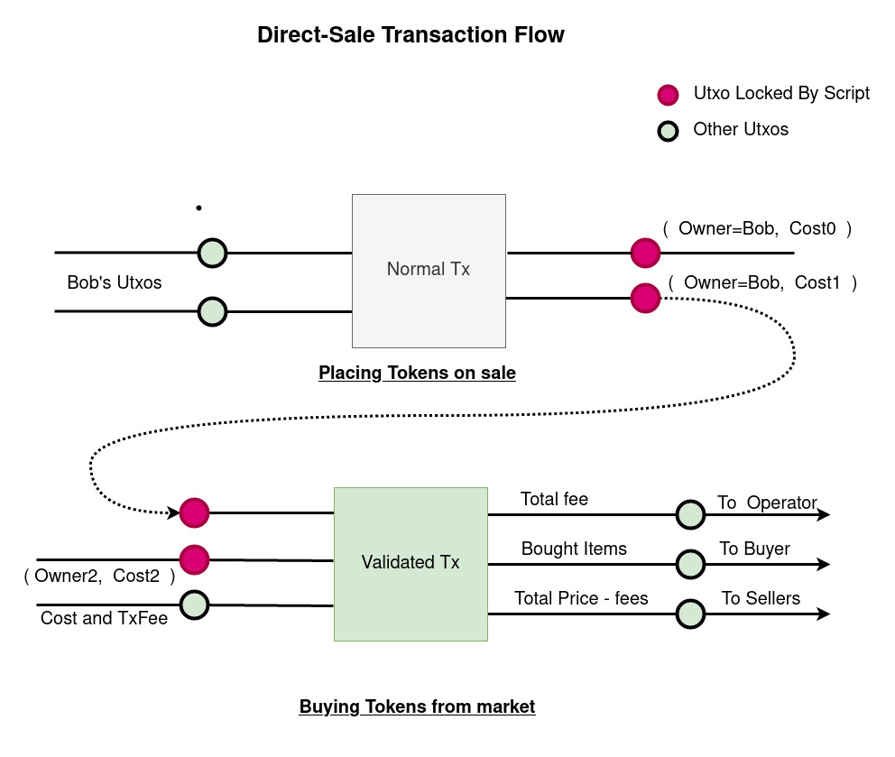

# Plutus Tokens MarketPlace


## Setting up

- Assume that we are in directory /home/user, clone this project to directory `/home/user/plutus-use-cases`
- Install Nix [Instructions](https://nixos.org/download.html)
- Create either `/etc/nix/nix.conf` or `~/.config/nix/nix.conf` with following content

```
substituters        = https://hydra.iohk.io https://iohk.cachix.org https://cache.nixos.org/
trusted-public-keys = hydra.iohk.io:f/Ea+s+dFdN+3Y/G+FDgSq+a5NEWhJGzdjvKNGv0/EQ= iohk.cachix.org-1:DpRUyj7h7V830dp/i6Nti+NEO2/nhblbov/8MW7Rqoo= cache.nixos.org-1:6NCHdD59X431o0gWypbMrAURkbJ16ZPMQFGspcDShjY=
```

- Clone https://github.com/input-output-hk/plutus to `/home/user/plutus`
- cd to /home/user/plutus and Checkout `plutus-starter-devcontainer/v1.0.6` tag
- On the Plutus repository root, issue `nix-shell` command
- Inside the nix shell, `cd` to `/home/user/plutus-use-cases/dquadrant/nft`

##### Running Tests
 ` cabal test plutus-tokens:test:tokens-test`

##### Starting PAB server
 `cabal run tokens-pab`

Pab server will be available  available on http://localhost:8080 .

In the PAB server simulation,
- Wallet 10 is operator of the market
- Wallet 1-5 have active endpoints to interact with them.

During the simulation at anytime, you can give `\n` (NewLine or Enter) key input to the pab-server to see it's status.
It will list all the wallets and balances in them.

##### Starting the client  [Instructions here](./client/README.md)


## Architecture
### DirectSale
Direct Sale is created by submitting a utxo to scriptAddress with Datum containing `DirectSale` Datum.
Anyone can then claim the utxos by paying enough to the seller and fees to operator.



#### Place for sale
Requires list of Objects. Each object has `spItems`, the list of tokens to be sold,
`spSaleType` `Primary` if it's you created the NFT `Secondary` if you own the nft,
but you didn't create it.
```http request
POST http://localhost:8080/api/new/contract/instances/${instance_id}/sell
[{
  "spItems": [{currency: "${NftPolicy}", token: "${NftTokenName}", value: 1}],
  "spSaleType": "Primary",
  "spCost": {currency: "", token: "", value: 100}
}]
```
#### List Items on Direct Sale.

Will return a list of items in sale, each items has a key `reference` and it's value is the `TxOutRef` model.
You use the `reference` to buy it from market
```http request
POST http://localhost:8080/api/new/contract/instances/${instance_id}/list
{
  "lmUtxoType": "MtDirectSale",
}
```
#### Purchase  items
Purchase transaction can be made posting  `PurchaseParam` model to the endpoint.
`ppItems` are the List of Reference returned in the list response

```http request
POST http://localhost:8080/api/new/contract/instances/${instance_id}/buy
{
   "ppItems": [${Refreence in response}],
   "ppValue": "cost": {
            "currency": "",
            "token": "",
            "value": 200000
          }
}
```

### Auction
The token or value to be placed for auction is sent to market script
with `Auction` Datum. The Datum contains auction's expiry, startBid ,increment and it's currentBidder


#### Place on Auction
List of Auction Items. The model contains `apValue` the value to be placed on auction `apMinBid`,
the starting bid , `apMinIncrement` minimum increment to be added to bid in each new bid, and other configurations. respectively as shown below
```http request
POST http://localhost:8080/api/new/contract/instances/${instance_id}/startAuction
[{
  "apValue": [{
    "currency": "${Policy_id}",
    "token": "${Token Name in Hex}",
    "value": 1
  }],
  "apMinBid": {
    "currency": "${Policy_id to receive bid in},
    "token": "$(Token Name in Hex)"
    "value": 2000000
  },
  "apMinIncrement": 1000000,
  "apStartTime": {"getPOSIXTime": 1596059091},
  "apEndTime": {"getPOSIXTime": 1596059091}
}]
```

#### List Items on Auction.

Will return a list of items in auction, each items has a key `reference` and it's value is the `TxOutRef` model.
You use the `reference` to bid it from market
```http request
POST http://localhost:8080/api/new/contract/instances/${instance_id}/list
{
  "lmUtxoType": "MtAuction",
}
```

### Bid On an Auction Item

Model contains `ref`, the `TxOutRef` model returned in the auction item when listing.
and `bidValue` list of tokens and it's value to place on bid.
Bidding is done only on the token having same policyId and tokenName as provided in createAuction endpoint.
Other values will be received by the auction creator as tips.
```http request
POST http://localhost:8080/api/new/contract/instances/${instance_id}/bid
{
  "ref": item.arBidder.bBidReference,
  "bidValue": [
    {
      "currency": item.arMinBid.currency,
      "token": item.arMinBid.token,
      "value": item.minNewBid
    }
  ]
}
```
### Claim Auction


