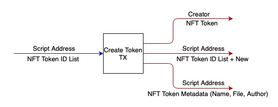
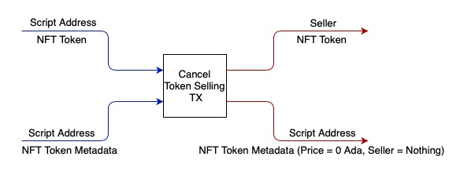

# NFT Marketplace.

This project is an NFT marketplace demo
User can create NFT tokens, sell and but them on a marketplace.

## Architecture
### Start Contract
On a contract start we create single NFT market utxo used to uniqely identity marketplace.
It is also used to store all the create tokens metadata to avoid duplicates.

### Create NFT
When create token method is invoked, we create two unique native tokens. One is the NFT token and it is send to the owner wallet, owner can sent it to other user address.
Another one is the NFT metadata token. Metadata token is stored in the marketpalce and never leaves it. In the metadata token datum we store the Symbol of the NFT token and all metadata information (e.g. name, description, file).



In the validator we consume market token to verify that new token is unique.

### Put token on sale
At any moment token owner can put token on sale, he transfers his token to the marketplace and set token price. Only tokens created in the market could be put on sale.


### Buy token on sale.
If token is on sale, any user can buy it. Buyer receives the NFT token, Seller gets the price.


### Cancel selling
Token owner could decide to cancell sell. He will get the NFT token back. Token will be removed from the store.


### Transfer token
Owner could transfer token to any other user directly. NFT metadata tracks owner only when the token is on sale.

## Setting up

For now, the only supported tooling setup is to use the provided VSCode devcontainer to get an environment with the correct tools set up.

- Install Docker
- Install VSCode
  - Install the [Remote Development extension pack](https://marketplace.visualstudio.com/items?itemName=ms-vscode-remote.vscode-remote-extensionpack)
  - You do *not* need to install the Haskell extension
- Get the docker image (for now, we need to build this with Nix)
  - Clone https://github.com/input-output-hk/plutus 
  - Set up your machine to build things with Nix, following the Plutus README (make sure to set up the binary cache!)
  - Build and load the docker container: `docker load < $(nix-build default.nix -A devcontainer)`
- Clone this repository and open it in VSCode
  - It will ask if you want to open it in the container, say yes.
  - `cabal build` from the terminal should work
  - Opening a Haskell file should give you IDE features (it takes a little while to set up the first time)

## The Plutus Application Backend (PAB) example

We have provided an example PAB application in `./pab`. With the PAB we can serve and interact
with contracts over a web API. You can read more about the PAB here: [PAB Architecture](https://github.com/input-output-hk/plutus/blob/master/plutus-pab/ARCHITECTURE.adoc).

Here, the PAB is configured with the `NFT` contract from `./src/Plutus/Contracts/NFT.hs`

Here's an example of running and interacting with this contract via the API. For this it will help if you
have `jq` installed.

1. Build the PAB executable:

```
cabal build nft-market-pab
```

2. Run the PAB binary:

```
cabal exec -- nft-market-pab
````

This will then start up the server on port 8080. The devcontainer process will then automatically expose this port so that you can connect to it from any terminal (it doesn't have to be a terminal running in the devcontainer).

1. Contract started in the server start script

2. Get the status

```
export INSTANCE_ID=...
curl -s http://localhost:8080/api/new/contract/instance/$INSTANCE_ID/status | jq
```

This has a lot of information; and in particular we can see what endpoints are still available
to call.

3. Start by creating NFT token

Create token
```
export INSTANCE_ID=...
curl -H "Content-Type: application/json" \
  --request POST \
  --data '{"cpTokenName":"TestToken","cpDescription":"Test description","cpAuthor":"John Smith","cpFile":"https://ipfs.io/ipfs/bafybeieznanm2s27u2okty2xgorltsfoegtgvamovfjx56ctgijtz4caoy"}' \
  http://localhost:8080/api/new/contract/instance/$INSTANCE_ID/endpoint/create
```

Get response
```
curl -H "Content-Type: application/json" \
  --request GET \
  http://localhost:8080/api/new/contract/instance/$INSTANCE_ID/status | jq '.cicCurrentState.observableState'
```

4. Query my nft tokens.
```
export INSTANCE_ID=...
curl -H "Content-Type: application/json" \
  --request POST \
  --data '[]' \
  http://localhost:8080/api/new/contract/instance/$INSTANCE_ID/endpoint/userNftTokens
```

Get response
```
curl -H "Content-Type: application/json" \
  --request GET \
  http://localhost:8080/api/new/contract/instance/$INSTANCE_ID/status | jq '.cicCurrentState.observableState'
```

5. Put token on sell

```
export INSTANCE_ID=...
curl -H "Content-Type: application/json" \
  --request POST \
  --data '{"spSellPrice":1000,"spTokenSymbol": "a6c2e8c6df7c677db538b281eae38860ba78dc57ac7cea73af67c789a4c1a56b"}' \
  http://localhost:8080/api/new/contract/instance/$INSTANCE_ID/endpoint/sell
```

Get response
```
export INSTANCE_ID=...
curl -H "Content-Type: application/json" \
  --request GET \
  http://localhost:8080/api/new/contract/instance/$INSTANCE_ID/status | jq '.cicCurrentState.observableState'
```

6. Query all selling tokens
```
export INSTANCE_ID=...
curl -H "Content-Type: application/json" \
  --request POST \
  --data '[]' \
  http://localhost:8080/api/new/contract/instance/$INSTANCE_ID/endpoint/sellingTokens
```

Get response
```
curl -H "Content-Type: application/json" \
  --request GET \
  http://localhost:8080/api/new/contract/instance/$INSTANCE_ID/status | jq '.cicCurrentState.observableState'
```

7. Buy token

```
export INSTANCE_ID=...
curl -H "Content-Type: application/json" \
  --request POST \
  --data '{"bpTokenSymbol": "staQbIJe11Om2KUvRt1+1SivJXo4H+u6Wc8Nekh7VQA="}' \
  http://localhost:8080/api/new/contract/instance/$INSTANCE_ID/endpoint/buy
```

Get response
```
export INSTANCE_ID=...
curl -H "Content-Type: application/json" \
  --request GET \
  http://localhost:8080/api/new/contract/instance/$INSTANCE_ID/status | jq '.cicCurrentState.observableState'
```

8. Сancel token selling

```
export INSTANCE_ID=...
curl -H "Content-Type: application/json" \
  --request POST \
  --data '{"cspTokenSymbol": "a6c2e8c6df7c677db538b281eae38860ba78dc57ac7cea73af67c789a4c1a56b"}' \
  http://localhost:8080/api/new/contract/instance/$INSTANCE_ID/endpoint/cancelSell
```

Get response
```
export INSTANCE_ID=...
curl -H "Content-Type: application/json" \
  --request GET \
  http://localhost:8080/api/new/contract/instance/$INSTANCE_ID/status | jq '.cicCurrentState.observableState'
```

9. Get user key

```
export INSTANCE_ID=...
curl -H "Content-Type: application/json" \
  --request POST \
  --data '[]' \
  http://localhost:8080/api/new/contract/instance/$INSTANCE_ID/endpoint/userPubKeyHash
```

Get response
```
export INSTANCE_ID=...
curl -H "Content-Type: application/json" \
  --request GET \
  http://localhost:8080/api/new/contract/instance/$INSTANCE_ID/status | jq '.cicCurrentState.observableState'
```

9. Transfer Token

```
export INSTANCE_ID=...
curl -H "Content-Type: application/json" \
  --request POST \
  --data '{"tpTokenSymbol": "staQbIJe11Om2KUvRt1+1SivJXo4H+u6Wc8Nekh7VQA=", "tpReceiverWallet": 1}' \
  http://localhost:8080/api/new/contract/instance/$INSTANCE_ID/endpoint/transfer
```

Get response
```
export INSTANCE_ID=...
curl -H "Content-Type: application/json" \
  --request GET \
  http://localhost:8080/api/new/contract/instance/$INSTANCE_ID/status | jq '.cicCurrentState.observableState'
```

## [Run frontend](/market-web-app README.md)
